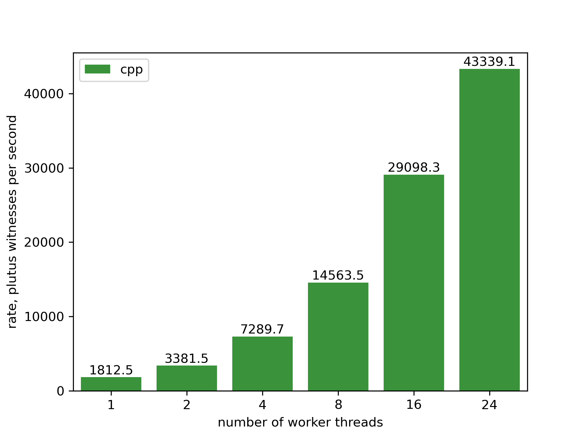
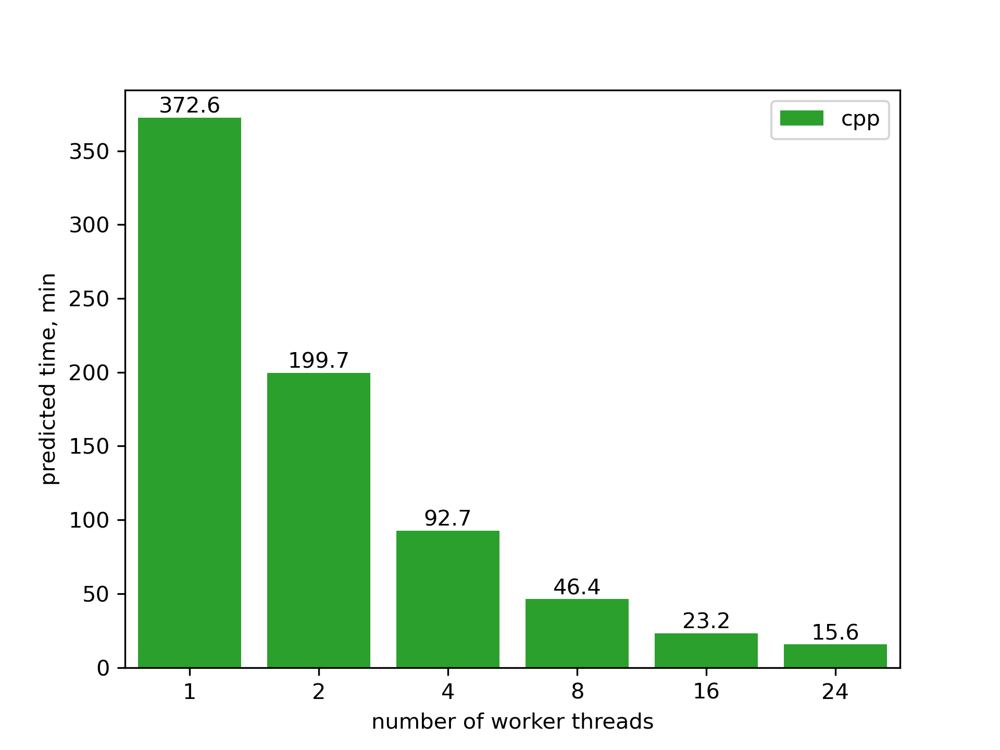

# Cross-Implementation Benchmarking Dataset for Plutus Performance

This dataset aims to fulfill the following requirements:
1. **Predictive Power**: Benchmark results should allow to predict the time required for a given implementation to validate all Plutus witnesses on the Cardano mainnet.
2. **Efficient Runtime**: The benchmark should complete quickly to enable rapid experimentation and performance evaluation.
3. **Parallelization Awareness**: It must assess both single-threaded and multi-threaded performance to identify implementation approaches that influence the parallel efficiency of script witness validation.
4. **Sufficient Sample Size**: The dataset should contain enough samples to allow computing reasonable sub-splits for further analysis, such as by Plutus version or by Cardano era.
5. **Implementation independence**: The dataset can be used with any Plutus implementation that supports the evaluation of CBOR-encoded Plutus scripts in the Flat format, the format used for storing Plutus scripts on the Cardano blockchain.

The procedure for creating this dataset is as follows (full reproduction instructions are provided below):
1. **Transaction Sampling**: Randomly without replacement select a sample of 256,000 mainnet transactions with Plutus script witnesses. This sample size is chosen as a balance between speed, sufficient data for analysis, and compatibility with high-end server hardware with up to 256 execution threads. The randomness of the sample allows for generalizable predictions of the validation time of all Plutus script witnesses.
2. **Script Preparation**: For each script witness in the selected transactions, prepare the required arguments and script context data. Save each as a Plutus script in the CBOR-encoded Flat format, with all arguments pre-applied.
3. **File Organization**: For easier debugging, organize all extracted scripts using the following filename pattern: ```<mainnet-epoch>/<transaction-id>-<redeemer-idx>-<script-hash>-<plutus-version>.flat.```

## Data
The latest dataset is available as a two-part archive to keep each downloadable file under 100 MB for problem-free downloads:
 - [dataset-20241119.tar.001.xz](./dataset-20241119.tar.001.xz)
 - [dataset-20241119.tar.002.xz](./dataset-20241119.tar.002.xz)

 It can be unpacked using the following Linux command, where ```<target-dir>``` is the destination directory after decompression:
 ```(bash)
 xz -dkc dataset-20241119.tar.*.xz | tar -C <target-dir> -xvf -
 ```

## Statistics describing the dataset
| Attribute | Value |
|-----------|-------|
| Script evaluation contexts | 479,264 |
| Unique mainnet scripts | 4,129 |
| Transactions | 256,000 |
| Compressed size | 149 MiB |
| Uncompressed size | 3,807 MiB |

## Statistics describing the Cardano mainnet at the generation time
| Attribute | Value |
|-----------|-------|
| Mainnet epoch | 521 |
| Total blocks | 11,098,770 |
| Total transactions | 99,172,115 |
| Total plutus redeemers | 40,525,056 |
| Total native-script witnesses | 16,259,963 |
| Total vkey witnesses | 167,742,451 |
| Unique plutus scripts | 95,459 |

# Latest benchmarks of the C++ Plutus implementation
The raw outputs of the benchmarking script are located in [20241119/raw-results.tar.xz](./20241119/raw-results.tar.xz).

## Plutus witness validation throughput



## Parallel efficiency of Plutus witness validation


## Predicted time to validate all mainnet Plutus witnesses



## Steps to reproduce

Rent a bare metal server with AMD EPYC 9354 CPUs with 24 physical cores at [Vultr](https://www.vultr.com/). Specify Ubuntu Linux 24.04 as the host operating system.

Install Docker:
```
apt update
apt install -y docker.io
```

Clone this repository and make it your working directory:
```
git clone https://github.com/sierkov/daedalus-turbo.git dt
cd dt
```

Build the test Docker container:
```
docker build -t dt -f Dockerfile.test .
```

Start the test container and make the host's /data dir accessible within the container:
```
test -d /data || mkdir /data
docker run -it --rm -v /data:/data dt
```

**All the following commands shall be executed in the container created by the previous command.**

Extract the benchmarking dataset:
```
xz -dkc ../experiment/plutus-benchmark/dataset-20241119.tar.*.xz | tar -C /data -xvf -
```

Run the benchmarking command:
```(bash)
for num_workers in 1 2 4 8 16 24; do
  ./dt plutus-benchmark /data/plutus-bench $num_workers cpp
done
```
The resulting CSV files can be found in ```/data/plutus-bench``` directory.

The source code:
- The benchmarking command is located in [lib/dt/cli/plutus-benchmark.cpp](../../lib/dt/cli/plutus-benchmark.cpp)
- The Jupyter notebook for generating the charts is located in [prep-charts.py](./prep-charts.py). It has been converted into plain Python with Jupytext for the ease of version control.

# Dataset creation procedure

The below commands are provided for reference purposes. Normally, the benchmarking dataset is extracted from the provided archive.

```(bash)
./dt sync-turbo /data/cardano --max-epoch=521
./dt txwit-prep /data/cardano /data/scriptctx
./dt plutus-extract-scripts /data/scriptctx ../experiment/plutus-benchmark/txs.txt /data/plutus-bench
```

The sampling of transactions can be reproduced using the following command:
```
./dt plutus-sample-txs /data/cardano /data/plutus-bench/txs-check.txt --seed=123456 --sample=256000
```

Collect statistics about the total counts of transaction witnesses:
```(bash)
./dt txwit-stat /data/cardano
```

The transaction sampling code is located in [lib/dt/cli/plutus-sample-txs.cpp](../../lib/dt/cli/plutus-sample-txs.cpp).
The plutus script extraction code is located in [lib/dt/cli/plutus-extract-scripts.cpp](../../lib/dt/cli/plutus-extract-scripts.cpp).
